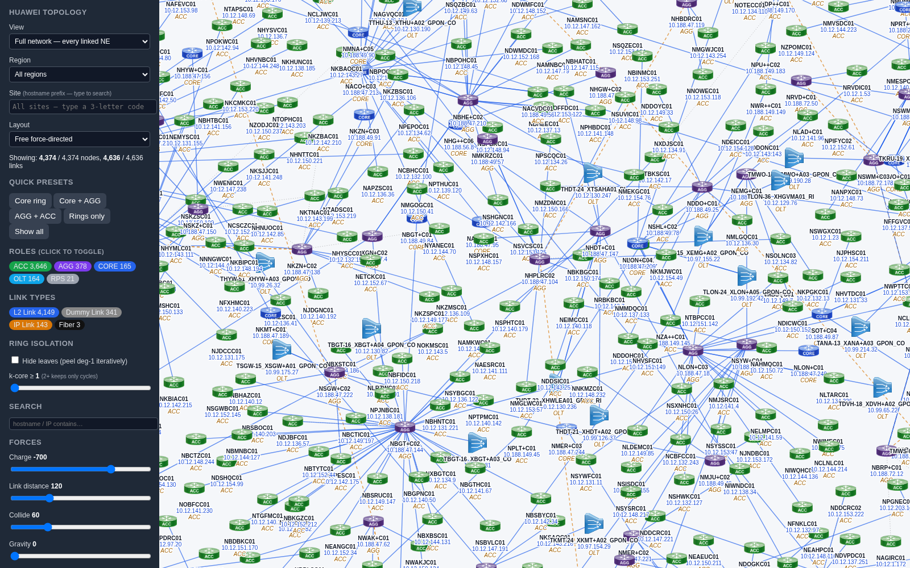
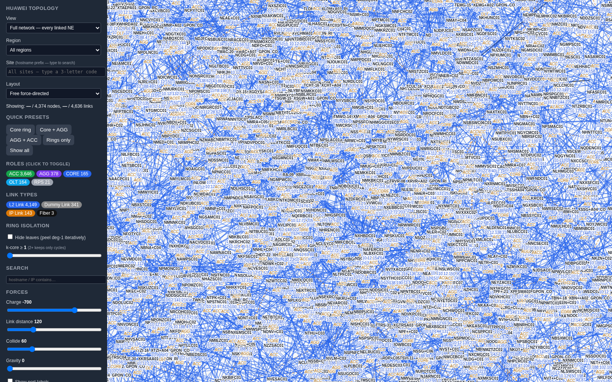
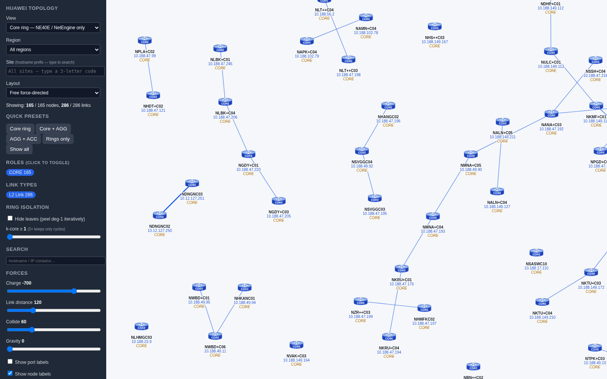
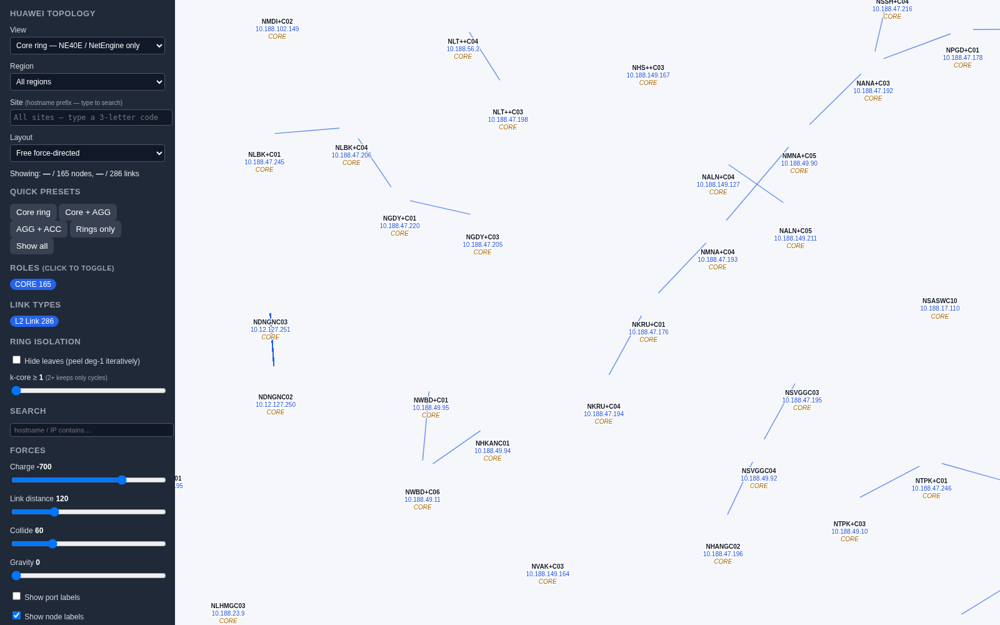

# Findings: Why the G6 Topology View Eats Memory and Freezes

*Personal findings — written up to share with the team.*

## What I was seeing

In our application we render the network topology with **AntV G6**. I kept noticing
that the topology tab was painfully heavy — it would climb past **1 GB of memory**,
sit at **~117% CPU**, and on the full network it would just show a **black screen**
and never finish loading. The browser tab would keep spinning forever.

## What I did to test it

To isolate the engine from everything else, I **recreated the exact same topology
canvas in D3** alongside the G6 one. Both builds:

- load the **identical** `topology-*.js` datasets, and
- draw the same thing (icons + 3-line node labels + the force-directed layout),
- so the **only** difference between them is the rendering engine — D3 vs G6.

That gave me a clean A/B test. Then I built a small headless-Chrome benchmark that
loads each build unmodified, and measures memory and CPU from the browser side (so a
frozen page can't fudge the numbers). I ran it across three graph sizes:
**core (165 nodes), e2e (846 nodes), and full (4,374 nodes).**

## What I found

| View | Nodes | D3 (memory / CPU) | G6 (memory / CPU) | G6 result |
|------|------:|-------------------|-------------------|-----------|
| core | 165 | 13 MB / 1.2 s | **152 MB / 17.8 s** | renders, but 100% CPU |
| e2e | 846 | 51 MB / 5.4 s | **251 MB / 15.5 s** | sluggish |
| full | 4,374 | 58 MB / 7.4 s → **rendered in ~1.8 s, stayed interactive** | **304 MB / 20.1 s (pegged)** | **frozen — never finished loading** |

**Proof — the full network (4,374 nodes), same data, side by side:**

| D3 — settled in ~1.8 s, fully interactive | G6 — pegged at 100% CPU, frozen / never loads |
|:---:|:---:|
|  |  |

> *The G6 frame was captured at the 20-second mark — by then it had finally painted a
> dense, unsettled tangle, but the page was still frozen and had never fired its load
> event. While I was actually using it, this same window just showed up as a **black
> screen**.*

In plain terms: on the full network, **D3 drew the whole graph in under 2 seconds and
stayed responsive, while G6 used several times the memory, pinned the CPU at 100%, and
never even fired the page's load event within 60 seconds.** That frozen, pre-paint
window is exactly the "black screen" I'd been seeing.

This lined up perfectly with what I'd already seen in the real browser's task manager:
**D3 tab ≈ 247 MB and idle; G6 tab ≈ 1.1 GB and pegged.**

## What I actually learned (I was partly wrong)

The cause isn't a bug in our code — it's simply how the two libraries work under the hood:

- **D3** draws plain SVG and lets the browser manage it, so it stays light even with
  4,374 nodes.
- **G6** keeps a full in-memory scene graph — every node is a group of ~4–5 shapes,
  ~18,000 objects total — held in memory permanently, and it **re-renders that entire
  scene on every step of the force simulation.** That's what burns the CPU and the RAM.

So my corrected understanding is: **this is an architecture/workload mismatch, not a
code bug.** For our specific case — thousands of nodes, force-directed, rich per-node
visuals — D3's lightweight approach is simply a much better fit than G6's retained-mode
canvas, *as we're currently using it.*

And to be fair to G6: at small scale it renders perfectly well. On the **core view
(165 nodes)** below, both look clean — G6 just already costs ~152 MB and ~18 s of CPU
to get there. So this is a **scaling** problem, not "G6 is broken":

| D3 — core view (165 nodes) | G6 — core view (165 nodes) |
|:---:|:---:|
|  |  |


## Findings

1. For the full/large topology views, **use the D3 build** — it's proven, fast, and light.
2. If we want to stay on G6, treat the large view as a **tuning task** (WebGL + worker
   layout + stop per-tick re-render + simpler nodes) and then re-run this same
   benchmark to confirm it actually closes the gap.


## Anyone can reproduce this

**Repository Link** : https://github.com/Giridharan-azalio/Topology-D3-G6
```bash
cd "Topology-views 1/bench"
npm install
node runner.js     # ~2.5 min — regenerates the table and the screenshots
```

It loads the real D3 and G6 pages unmodified, only injecting a measurement probe, and
prints the comparison above. Raw numbers are in `bench/results.json` and the
screenshots are in `bench/shots/`.

